# Architecture & Flow Diagrams (Mermaid)

## 1. High-Level System Architecture

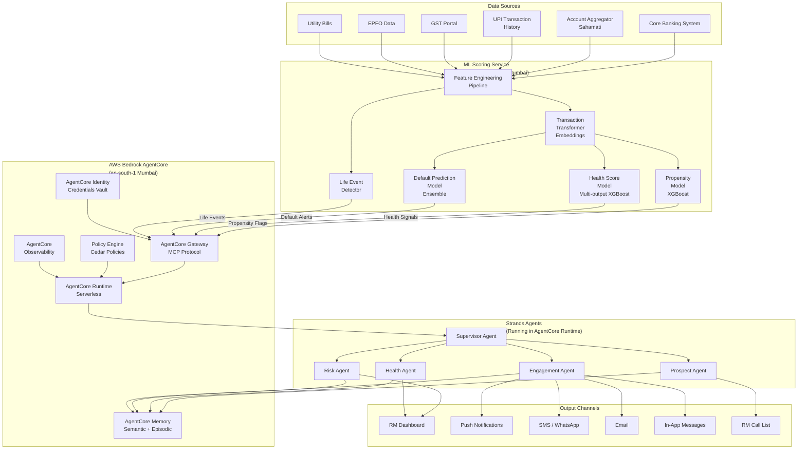

---

## 2. Agent Orchestration Flow (Functional)

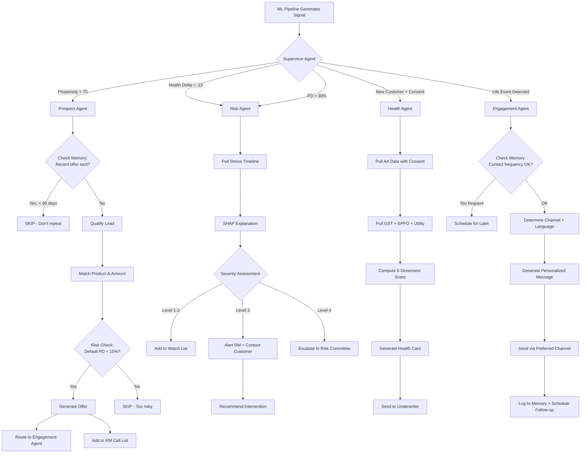

---

## 3. Data Pipeline Flow

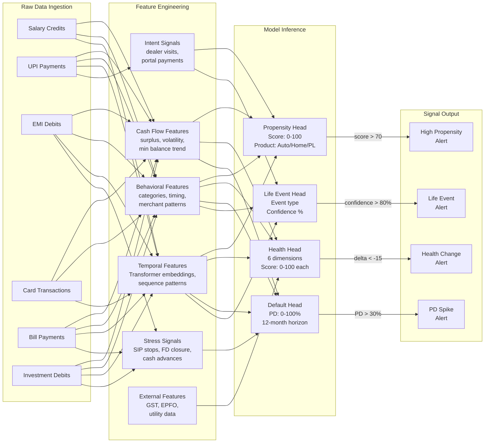

---

## 4. AgentCore Memory Architecture

```mermaid
graph TB
    subgraph "AgentCore Memory"
        subgraph "Semantic Memory<br/>(Long-term Knowledge)"
            SM1[Customer Financial Profile]
            SM2[Product Holdings & Preferences]
            SM3[Risk Assessment History]
            SM4[Life Events Detected]
        end
        
        subgraph "Episodic Memory<br/>(Interaction History)"
            EM1[Agent Actions Taken]
            EM2[Customer Responses]
            EM3[RM Conversation Summaries]
            EM4[Offer Acceptance/Rejection]
        end
        
        subgraph "User Preference Memory<br/>(Communication Style)"
            PM1[Preferred Language]
            PM2[Preferred Channel]
            PM3[Preferred Timing]
            PM4[Contact Frequency Limit]
        end
    end

    subgraph "Agents Read & Write"
        PA[Prospect Agent]
        HA[Health Agent]
        RA[Risk Agent]
        EA[Engagement Agent]
    end

    PA -->|Reads| SM1
    PA -->|Reads| EM4
    PA -->|Writes| EM1

    HA -->|Writes| SM1
    HA -->|Writes| SM3
    HA -->|Reads| SM4

    RA -->|Reads| SM3
    RA -->|Reads| EM1
    RA -->|Writes| EM1

    EA -->|Reads| PM1
    EA -->|Reads| PM2
    EA -->|Reads| PM3
    EA -->|Reads| PM4
    EA -->|Reads| EM1
    EA -->|Writes| EM2
```

---

## 5. Multi-Bank Deployment Architecture (Non-Functional)

```mermaid
graph TB
    subgraph "Bank A - IDBI"
        A_GW[Gateway<br/>IDBI CBS API<br/>IDBI Notification]
        A_RT[Runtime<br/>Same Agent Code]
        A_MEM[Memory<br/>IDBI Customers]
        A_ID[Identity<br/>IDBI Credentials]
        A_ML[ML Models<br/>Trained on IDBI Data]
    end

    subgraph "Bank B - SBI"
        B_GW[Gateway<br/>SBI YONO API<br/>SBI Notification]
        B_RT[Runtime<br/>Same Agent Code]
        B_MEM[Memory<br/>SBI Customers]
        B_ID[Identity<br/>SBI Credentials]
        B_ML[ML Models<br/>Trained on SBI Data]
    end

    subgraph "Bank C - PNB"
        C_GW[Gateway<br/>PNB CBS API<br/>PNB Notification]
        C_RT[Runtime<br/>Same Agent Code]
        C_MEM[Memory<br/>PNB Customers]
        C_ID[Identity<br/>PNB Credentials]
        C_ML[ML Models<br/>Trained on PNB Data]
    end

    subgraph "Shared Platform Code"
        SC[Strands Agent Code<br/>Supervisor + Sub-Agents]
        FE[Feature Engineering<br/>Pipeline Code]
        DASH[Dashboard<br/>Template]
    end

    SC --> A_RT
    SC --> B_RT
    SC --> C_RT
    FE --> A_ML
    FE --> B_ML
    FE --> C_ML
    DASH --> A_RT
    DASH --> B_RT
    DASH --> C_RT
```

---

## 6. Agent Autonomy Tiers (Governance Flow)

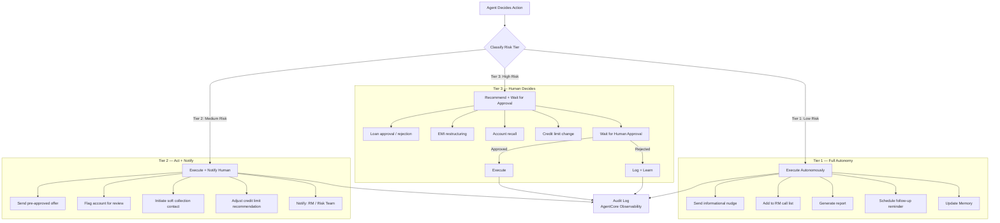

---

## 7. Customer Lifecycle Journey (Sequence Diagram)

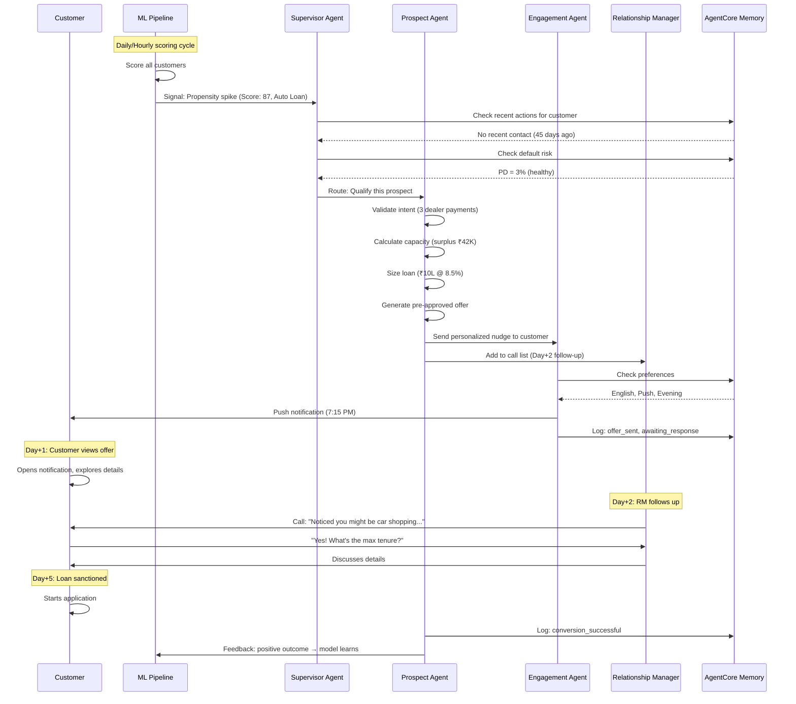

---

## 8. Early Warning Sequence (Default Prevention)

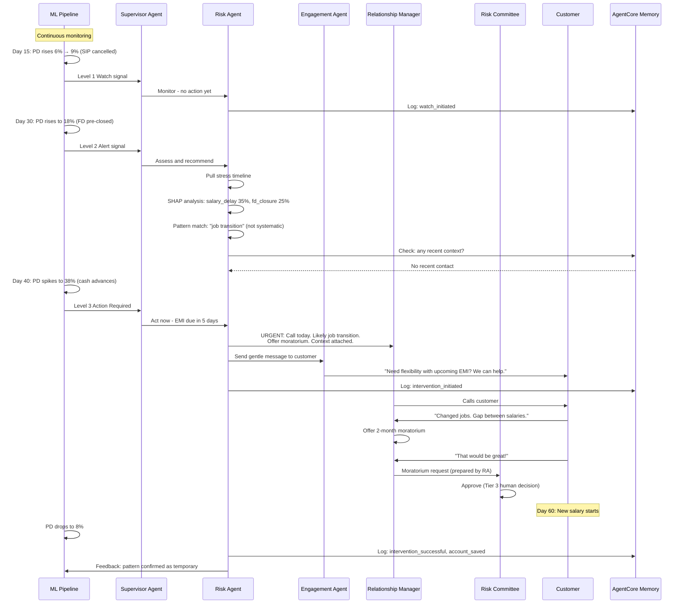

---

## 9. Health Card Assessment Flow

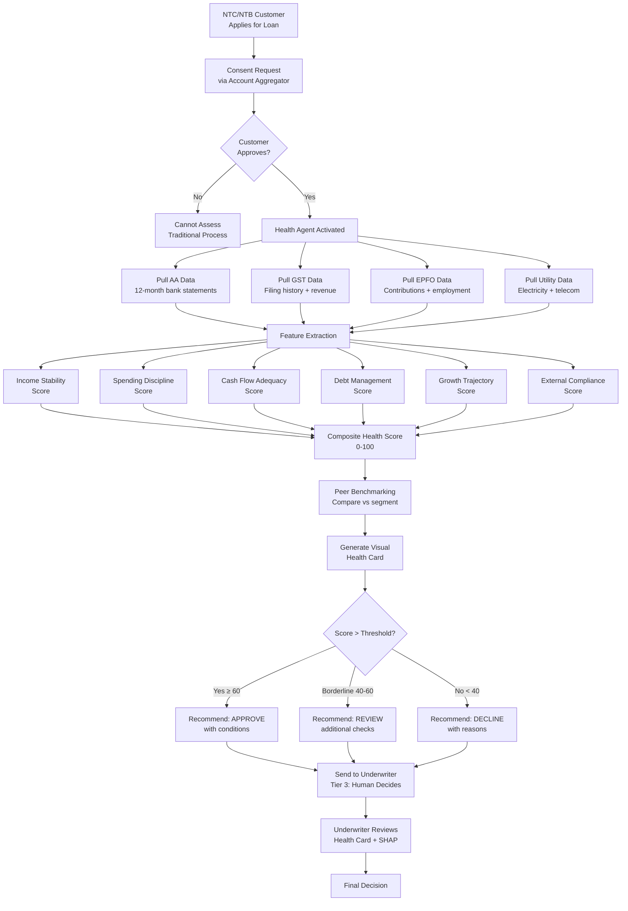

---

## 10. Non-Functional Architecture (Scalability & Security)

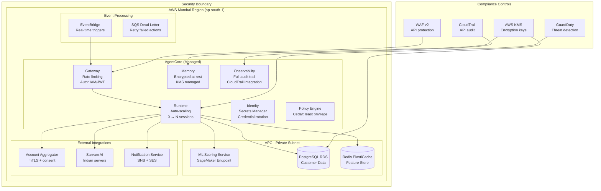

---

## 11. Scalability Metrics (Non-Functional Requirements)

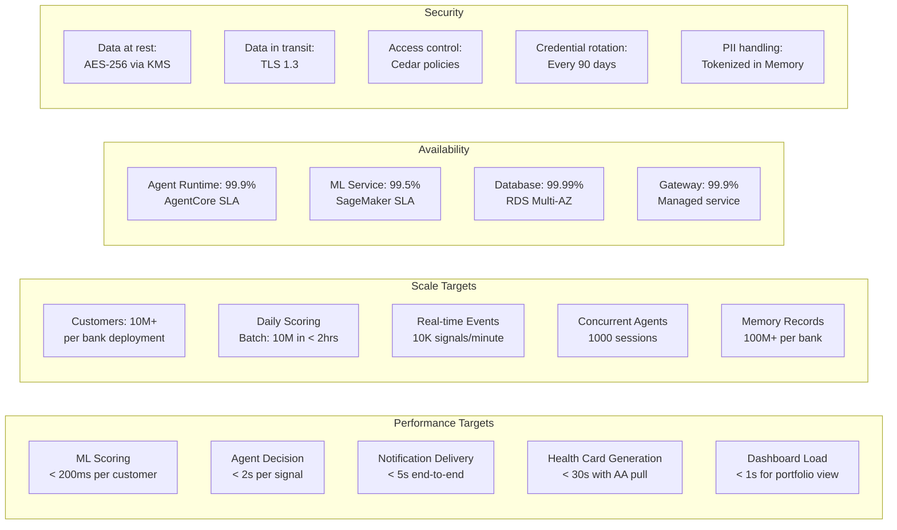

---

## 12. Event-Driven Architecture Flow

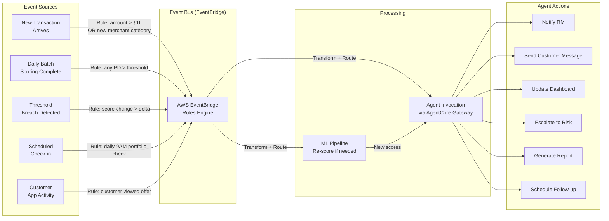

---

## 13. Compliance & Audit Architecture

```mermaid
flowchart TD
    subgraph "Every Agent Action"
        AA[Agent Action Initiated]
        AA --> LOG[Log to AgentCore<br/>Observability]
        AA --> AUD[Write Audit Record<br/>to PostgreSQL]
        AA --> MEM_LOG[Update AgentCore<br/>Memory - Episodic]
    end

    subgraph "Audit Record Contents"
        AUD --> R1[Timestamp]
        AUD --> R2[Agent ID + Name]
        AUD --> R3[Customer ID]
        AUD --> R4[Action Type]
        AUD --> R5[Input Signal<br/>ML scores that triggered]
        AUD --> R6[Agent Reasoning<br/>Why this action was chosen]
        AUD --> R7[SHAP Explanation<br/>Model feature importance]
        AUD --> R8[Outcome<br/>Success/Failure/Pending]
        AUD --> R9[Human Override<br/>If any]
    end

    subgraph "RBI Compliance Checks"
        CHK1[Kill-Switch<br/>Disable agent in < 1min]
        CHK2[Human Override<br/>100% of Tier 3 decisions]
        CHK3[Explainability<br/>Every prediction has SHAP]
        CHK4[Model Inventory<br/>All models registered + versioned]
        CHK5[Drift Monitoring<br/>Weekly accuracy checks]
        CHK6[Data Lineage<br/>Source → Feature → Prediction → Action]
    end

    LOG --> DASH_INT[Internal Compliance<br/>Dashboard]
    AUD --> DASH_INT
    CHK1 & CHK2 & CHK3 & CHK4 & CHK5 & CHK6 --> DASH_INT
    DASH_INT --> RBI_REP[RBI Regulatory<br/>Reporting]
```

---

## 14. Customer Engagement Decision Tree

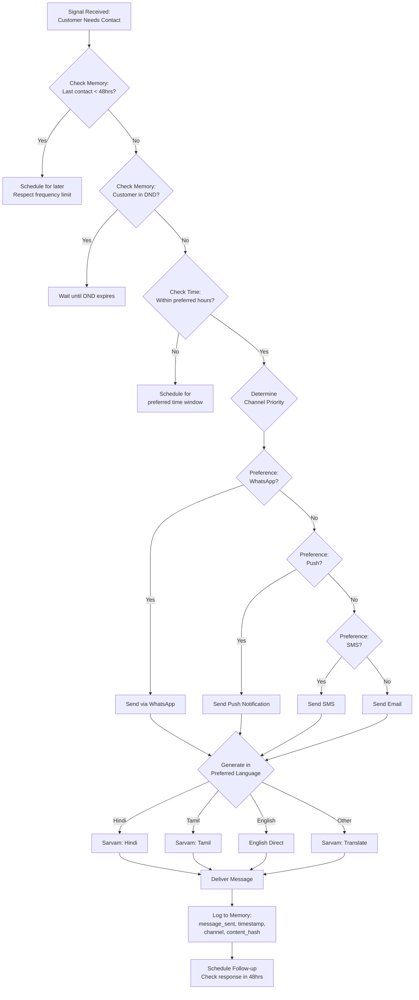
